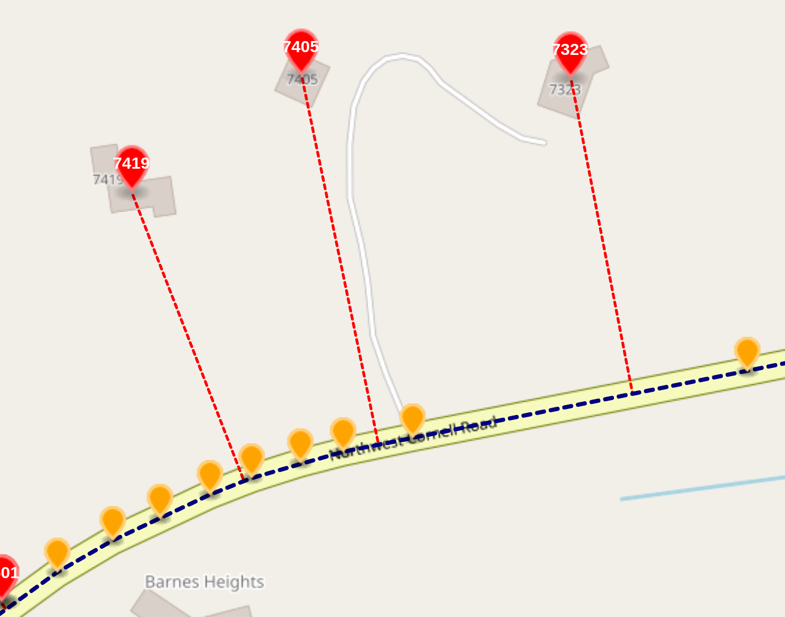
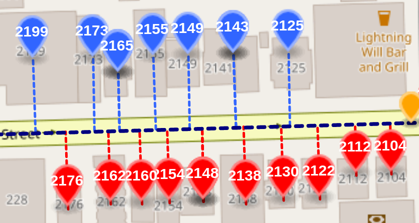

# Interpolation Database Schema

The Pelias Interpolation engine currently uses two [SQLite](https://sqlite.org) databases for
storing street and address information. This document explains the most important tables in these
databases and the meanings of the various fields.

## Street database

The street database contains several tables with data regarding streets.

### `polyline` table

| field | type | description |
| --- | --- | --- |
| id | `INTEGER` | the primary key for a given street |
| line | `TEXT` | polyline encoded linestring |

The polylines table contains a unique identifier for each street, as well as its geometry as a
[polylines encoded string](https://developers.google.com/maps/documentation/utilities/polylinealgorithm) with precision `6`.

Tools for working with polyline-encoded strings include:
- [@mapbox/polyline](https://github.com/mapbox/polyline) Node.js package
- [polyline](https://pypi.org/project/polyline/) Python package.

### `names` table

The names table contains information on names for a given street. Streets can have multiple names,
so there may be multiple rows in the `names` table for a given row in the `polyline` table.

| field | type | description |
| --- | --- | --- |
| rowid | `INTEGER` | the primary key column for this table, not generally referenced |
| id | `INTEGER` | a foreign key to the corresponding row in the `polyline` table |
| name | `TEXT` | the name of the street |

## Address database

The address database contains a single table with information on notable points associated with
streets. These points might represent an exact address, the start or end of an address range, or
merely a point along a curved street.

### `address` table

| field | type | description |
| --- | --- | --- |
| rowid | `INTEGER` | the primary key column for this table, not generally referenced |
| id | `INTEGER` | a foreign key to the corresponding row in the `polyline` table |
| source | `TEXT` | the datasource for this point |
| source_id | `TEXT` | a unique identifier for this point from the original datasource (if applicable) |
| housenumber | `REAL` | an exact or interpolated housenumber for this point |
| lat | `REAL` | the latitude of this address point |
| lon | `REAL` | the longitude of this address point |
| parity | `TEXT` | Either `L` or `R` if this is an exact address, denoting the side of the street the address is on  |
| proj_lat | `REAL` | The projected point along the related street corresponding to this address |
| proj_lon | `REAL` | The projected point along the related street corresponding to this address |

#### `source` field

The source field stores information on the origin of this particular address point. There are
several options:

- **OA**: this point is an exact address from [OpenAddresses](https://openaddresses.io/)
- **OSM**: this point is an exact address from [OpenStreetMap](https://openstreetmap.org)
- **TIGER**: this point is derived from an address range from [TIGER](https://www.census.gov/geographies/mapping-files/time-series/geo/tiger-line-file.html)
- **VERTEX**: this point represents a vertex along a curved street

#### `housenumber` field

The housenumber field contains the housenumber associated with this point. It will be an exact
housenumber for records from OSM or OA, or a decimal value for vertex points along the street.

#### `lat` and `lon` fields

These fields contain the coordinates of this point.

For exact addresses from OSM and OA, or address range points from tiger, the coordinates the exact
location of an address. This point is likely some distance away from the corresponding street.

For vertices, this is the exact point along the street where this vertex lies.

#### `proj_lat` and `proj_lon` fields

These fields are only present for exact address or address range points. They represent the
[orthogonal projection](https://en.wikipedia.org/wiki/Projection_(linear_algebra)) of this address
point along the corresponding street.

## Real world examples

### Projection

In the image from the interpolation demo interface below, the red pins represent the
address points, and the dashed red line connects the address points to their corresponding projected
point along the street. The orange pins represent `VERTEX` points.

### Parity

This image shows a street with addresses on each side. The interpolation engine has detected which
addresses are on the left (red) and right (blue). In this case left and right describe the side of
the street when looking in the direction of increasing housenumbers.

